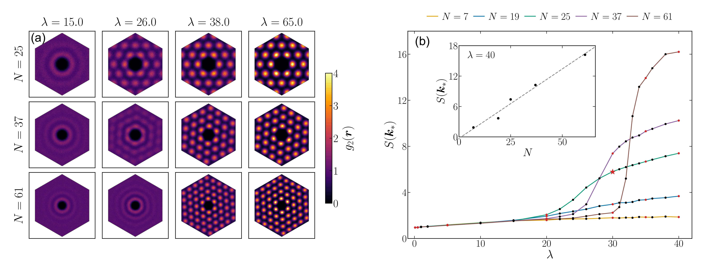

# BOSENET

Neural quantum states (NQS) for modeling interacting bosons

**Author:** Daniil Antonenko (antonenko.daniel@gmail.com)

## Overview

Variational neural quantum states (NQS) for variational Monte Carlo simulations of interacting bosons in the continuum model. 

The code is based on the FermiNet and Psiformer repos by Google DeepMind ([https://github.com/google-deepmind/ferminet](https://github.com/google-deepmind/ferminet)) with a different architecture that accounts for bosonic quantum statistics. 

## Requirements

See FermiNet requirements

## Usage

See an example of the optimization script in https://github.com/andanya/bosenet/bosef-10e-rep01.py. 
The training curves are saved to `train_stats.csv`
The positions of Monte-Carlo walkers are saved to `walkers_last.host0.npy`.

## License

Apache 2.0
